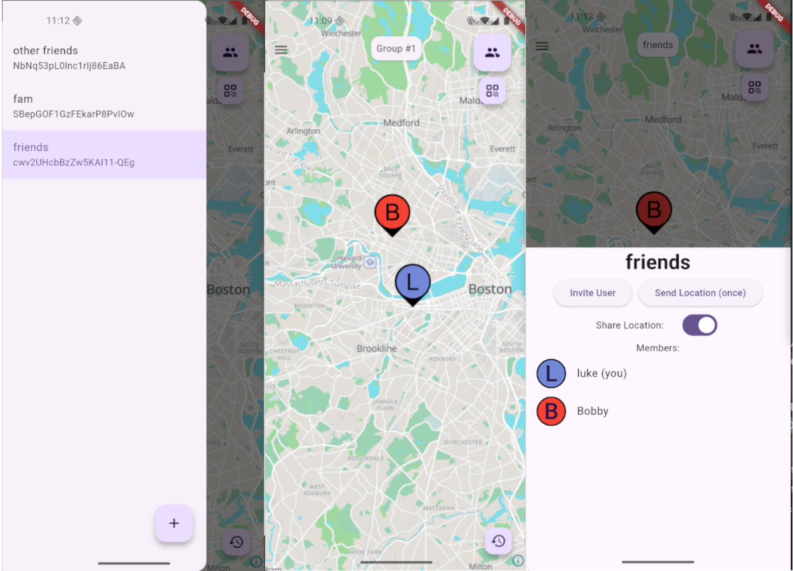

# Luogo

*A Simple & Secure Group Location Sharing Appp*  

<p align="center">
  <a href="https://opensource.org/license/eupl-1-2"></a>
  <a href="https://developer.android.com"></a>
  <a href="https://developer.apple.com/"></a>
</p>

<p align="center">
  
</p>



**Luogo** is a cross-platform mobile app that allows groups of people to easily share their location without it [being sold]([Life360 sells its family location tracking data — now it owns Tile | The Verge](https://www.theverge.com/2021/12/9/22820381/tile-life360-location-tracking-data-privacy)). Fully open source, writing in dart & rust, and utilizing modern MLS & encryption tech. You no longer have to trust a large corporatoin with your data.

---

## Features

- **Cross Compatible:** No more worrying about walled gardens. All of your friends can join regardless of platform. (iOS/Android)

- **Batteries Included:** No configuration required to get started. (Though you still can configure your [S5 Node](https://s5.pro/) if you wish).

- **MLS:** Utilizes [modern encryption](https://ed25519.cr.yp.to/) & [messaging protocols]([GitHub - openmls/openmls: Rust implementation of the Messaging Layer Security (MLS) protocol](https://github.com/openmls/openmls)) to make sure no one can read your location data unless you want them to.

- **Groups:** Granular group sharing so you can control who knows where you are.

- **One Time Send:** If you just want someone to have your location once, just send it with the one time button! No need to constantly send updates.

## Getting Started

**In Beta Period**: For now the best way to try the app is to go to the [Releases]([Releases · lukehmcc/luogo · GitHub](https://github.com/lukehmcc/luogo/releases)) page and download the Android APK file. This will be updated when the app gets pushed to the App/Play Stores.

### Development

To get started with local development do the following:

```bash
git clone --recursive https://github.com/lukehmcc/luogo.git # make sure to recuse submodules
# If you forgot to recurse and already cloned you can do this
# git submodule init && git submodule update
cd luogo/
./flutterw run # Make sure to run with the flutter wrapper so everyone is on the same flutter version
```

Feel free to [submit an issue]([GitHub · Where software is built](https://github.com/lukehmcc/luogo/issues)) or [PR]([Pull requests · lukehmcc/luogo · GitHub](https://github.com/lukehmcc/luogo/pulls)) if you run into any issues. I'm here to collaborate and make the best app possible!

## Architecture

Let's break this down into a couple parts:

**Backend:** Utilizes the [s5_messenger]([GitHub - s5-dev/s5_messenger: S5 Streams / MLS based messaging library](https://github.com/s5-dev/s5_messenger)) library to handle messaging between users. The users location is grabed from the [geolocator]([geolocator | Flutter package](https://pub.dev/packages/geolocator)), parsed into a [message format](https://github.com/s5-dev/s5_messenger/blob/main/lib/src/mls5/model/message.dart), then s5_messenger uses [openmls](https://crates.io/crates/openmls) to create the message in the respecitve group, and this message is relayed through the s5 network via a [streams message]([Streams - S5 Network Docs](https://docs.s5.pro/spec/streams.html)). This is then done in reverse by the other clients in the room.

**Front End:** Utilizes [Flutter](https://flutter.dev/) to handle cross-platform compling with a single codebase. [Cubits]([Bloc Concepts | Bloc](https://bloclibrary.dev/bloc-concepts/#creating-a-cubit)) are used to handle state and seperate out buisness logic from the UI. The UI code can be found in `lib/cubit` and the UI code is in in `lib/view`.  

## Etomology

Luogo is an Italian word for Place. Just thought it sounded nice (and no one had an app called that yet :p)

## Acknowledgement

This work is supported by a [Sia Foundation](https://sia.tech/) grant.
