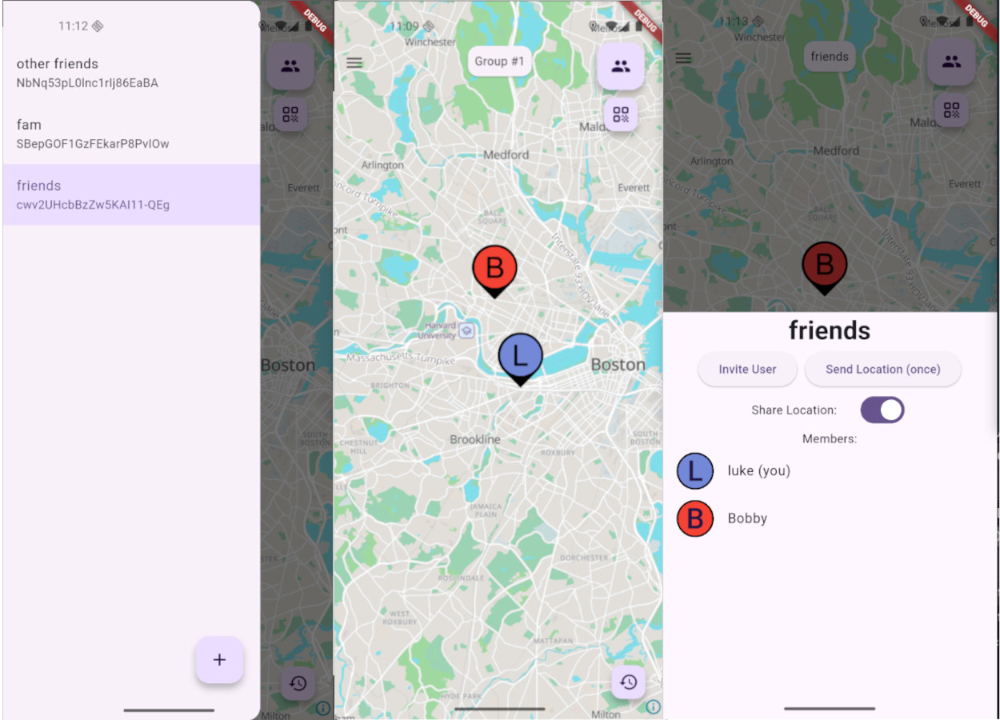

> ⚠️Luogo is beta software! I've done my best to build a functional app, but if you run into any issues please file an [issue](https://github.com/lukehmcc/luogo/issues).

# Luogo

*A Simple & Secure Group Location Sharing App*  

<p align="center">
  <a href="https://opensource.org/license/eupl-1-2"></a>
  <a href="https://developer.android.com"></a>
  <a href="https://developer.apple.com/"></a>
</p>

<p align="center">
  <a href="https://play.google.com/store/apps/details?id=app.luogo.app">
    
  </a>

  <a href="https://apps.apple.com/us/app/luogo-group-location-sharing/id6749677387">
    
  </a>
</p>

<p align="center">
  
</p>



**Luogo** is a cross-platform mobile app that allows groups of people to easily share their location without it [being sold](https://www.theverge.com/2021/12/9/22820381/tile-life360-location-tracking-data-privacy). Fully open source, written in dart & go, and utilizing modern encryption tech. You no longer have to trust a large corporatoin with your data.

---

## Features

- **Cross Compatible:** No more worrying about walled gardens. All of your friends can join regardless of platform. (iOS/Android)

- **Batteries Included:** No configuration required to get started. (Though you still can configure your own relay server if you wish).

- **E2E Encrypted:** Utilizes [modern encryption](https://pub.dev/packages/cryptography) to make sure no one can read your location data unless you want them to.

- **Groups:** Granular group sharing so you can control who knows where you are.

- **One Time Send:** If you just want someone to have your location once, just send it with the one time button! No need to constantly send updates.

## Getting Started

**In Beta Period**: For now the best way to try the app is to go to the [Releases](https://github.com/lukehmcc/luogo/releases) page and download the Android APK file. This will be updated when the app gets pushed to the App/Play Stores.

### Development

To get started with local development do the following:

```bash
git clone --recursive https://github.com/lukehmcc/luogo.git # make sure to recuse submodules
# If you forgot to recurse and already cloned you can do this
# git submodule init && git submodule update
cd luogo/
./flutterw run --flavor dev # Make sure to run with the flutter wrapper so everyone is on the same flutter version
```

To build a production apk:

```bash
./flutterw build appbundle --flavor prod
```

Feel free to [submit an issue](https://github.com/lukehmcc/luogo/issues) or [PR](https://github.com/lukehmcc/luogo/pulls) if you run into any issues. I'm here to collaborate and make the best app possible!

## Architecture

**Backend:** A single-binary [Go relay server](server/) (SQLite-backed) routes encrypted location messages between group members over WebSockets. Group keys are shared out-of-band via QR invite codes, so the server only ever sees ciphertext. The client's location is grabbed from the [geolocator](https://pub.dev/packages/geolocator), encrypted with [XChaCha20-Poly1305](https://pub.dev/packages/cryptography) using the per-group key, and pushed through the relay. Clients resync from the server's per-group message log on reconnect, so everyone stays up to date.

**Front End:** Utilizes [Flutter](https://flutter.dev/) to handle cross-platform compling with a single codebase. [Cubits](https://bloclibrary.dev/bloc-concepts/#creating-a-cubit) are used to handle state and seperate out buisness logic from the UI. The state code can be found in `lib/cubit` and the UI code is in in `lib/view`.  

## Etimology

Luogo is an Italian word for Place. Just thought it sounded nice (and no one had an app called that yet :p)

## Acknowledgement

Th work is supported by a [Sia Foundation](https://sia.tech/) grant.
